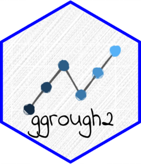

<!-- README.md is generated from README.Rmd. Please edit that file -->

```{r, include = FALSE}
knitr::opts_chunk$set(
  collapse = TRUE,
  comment = "#>",
  fig.path = "man/figures/README-",
  out.width = 800,
  message = FALSE
)
```

# ggrough2 

<!-- badges: start -->
[](https://github.com/schochastics/ggrough2/actions/workflows/R-CMD-check.yaml)
<!-- badges: end -->

**ggrough2** converts ggplot2 visualizations into hand-drawn, sketch-style graphics. It works by rendering your plot to SVG and then re-drawing every element using [Rough.js](https://roughjs.com/). 

This package is a rework of the dormant [ggrough](https://github.com/xvrdm/ggrough) package.

## Installation

```{r, eval = FALSE}
pak::pak("schochastics/ggrough2")
```

## Basic usage

Pass any ggplot object to `rough_plot()`.

```{r basic, eval = TRUE}
library(ggplot2)
library(ggrough2)

p <- ggplot(mpg, aes(displ, hwy)) +
  geom_point()

rough_plot(p, width = 7, height = 5)
```

## Fill styles

The `fill_style` argument controls how filled shapes (bars, areas, boxes) are
drawn. Available options are `"hachure"` (default), `"cross-hatch"`, `"dots"`,
`"zigzag"`, `"dashed"`, `"zigzag-line"`, and `"solid"`.

```{r fill-styles, eval = TRUE}

p <- ggplot(diamonds, aes(cut)) +
  geom_bar()

rough_plot(p, fill_style = "cross-hatch")
rough_plot(p, fill_style = "dots")
```

## Background fill style

Use `bg_fill_style` to control the fill style of panel and plot backgrounds
independently from data elements. By default backgrounds are `"solid"` while
geoms use `"hachure"`.

```{r bg-fill, eval = TRUE}

p <- ggplot(mpg, aes(displ, hwy)) +
  geom_point(size = 3) +
  theme(
    panel.background = element_rect(fill = "grey66"),
    plot.background  = element_rect(fill = "grey66")
  )

# solid panel background, hachure geoms (default)
rough_plot(p)

# hachure panel background, cross-hatch geoms
rough_plot(p, fill_style = "cross-hatch", bg_fill_style = "hachure")
```

## Roughness and bowing

`roughness` controls how jagged the lines are (0 = perfectly smooth, up to 10).
`bowing` controls how much straight lines bow outwards. Higher values create a more exaggerated hand-drawn effect.

```{r roughness, eval = TRUE}
p <- ggplot(mpg, aes(class)) +
  geom_bar()

rough_plot(p, roughness = 3, bowing = 2)
```

## Reproducible output

Rough.js uses randomness to vary each stroke. Pass `seed` to get a stable result.

```{r seed, eval = TRUE}
rough_plot(p, seed = 42)
rough_plot(p, seed = 42)
```

## Custom fonts

Text labels default to the bundled [Indie Flower](https://fonts.google.com/specimen/Indie+Flower) handwritten font.
Supply any font family name, or set `font = NULL` to keep the original plot fonts.

```{r font, eval = FALSE}
# any system font by name
rough_plot(p, font = "Arial")

# Google Font — download once, then use by name
add_google_font("Dancing Script")
rough_plot(p, font = "Dancing Script")

# keep the plot's original fonts
rough_plot(p, font = NULL)
```

## Fine-tuning with `rough_options()`

For finer control over fill appearance, pass a `rough_options()` list to the
`options` argument. All parameters default to `NULL` (library defaults apply).

**Hachure spacing and line weight** — `hachure_gap` sets the pixel distance
between fill lines; `fill_weight` sets their thickness.

```{r options-gap, eval = TRUE}
p <- ggplot(diamonds, aes(cut)) +
  geom_bar()

# wider gap between hachure lines, thicker lines
rough_plot(p, fill_style = "hachure",
           options = rough_options(hachure_gap = 6, fill_weight = 1.5))
```

**Hachure angle** — rotate the fill lines with `hachure_angle` (degrees).

```{r options-angle, eval = TRUE}
# nearly horizontal lines
rough_plot(p, fill_style = "hachure",
           options = rough_options(hachure_angle = -10))
```

**Zigzag fill** — `zigzag_offset` controls the width of the zigzag triangles
when using `"zigzag-line"` fill style.

```{r options-zigzag, eval = TRUE}
rough_plot(p, fill_style = "zigzag-line",
           options = rough_options(hachure_gap = 5, zigzag_offset = 8))
```

## Saving output

Export to a standalone HTML file (no external dependencies):

```{r save-html, eval = FALSE}
save_rough_html(p, "my_plot.html")
```

Export to PNG or SVG (requires the [webshot2](https://rstudio.github.io/webshot2/) package and a Chrome/Chromium installation):

```{r save-image, eval = FALSE}
save_rough_image(p, "my_plot.png")
save_rough_image(p, "my_plot.svg")
```
