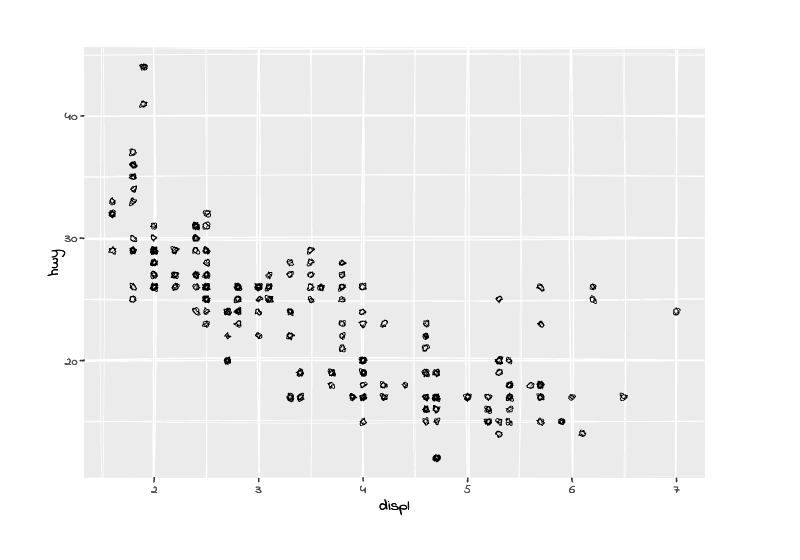
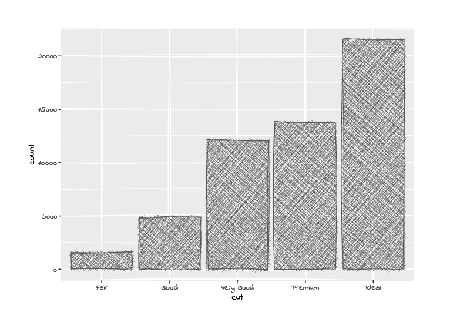
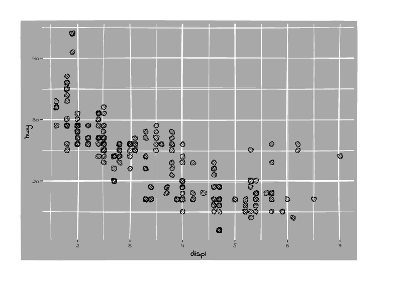
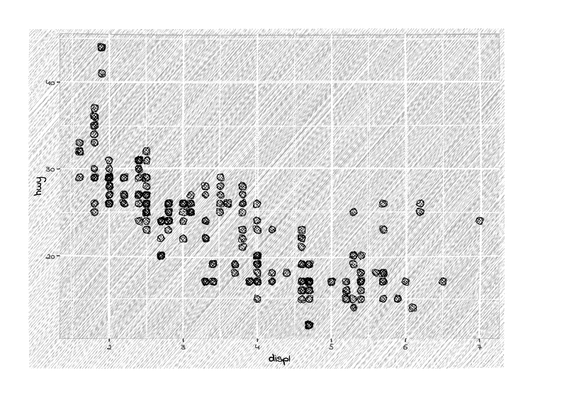
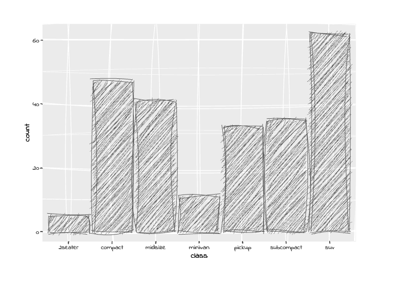
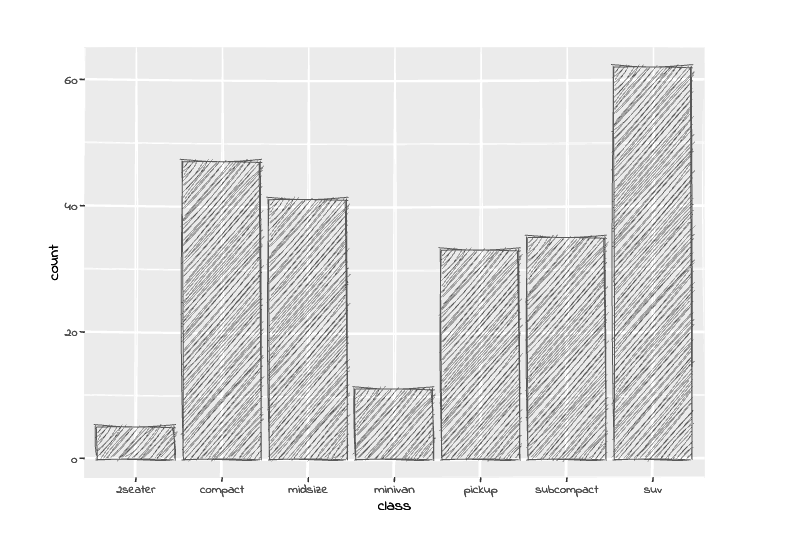
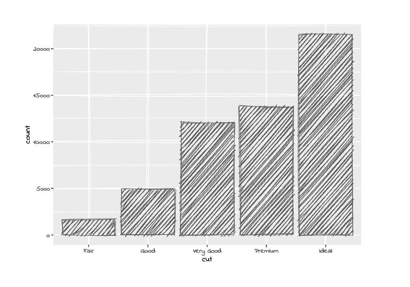
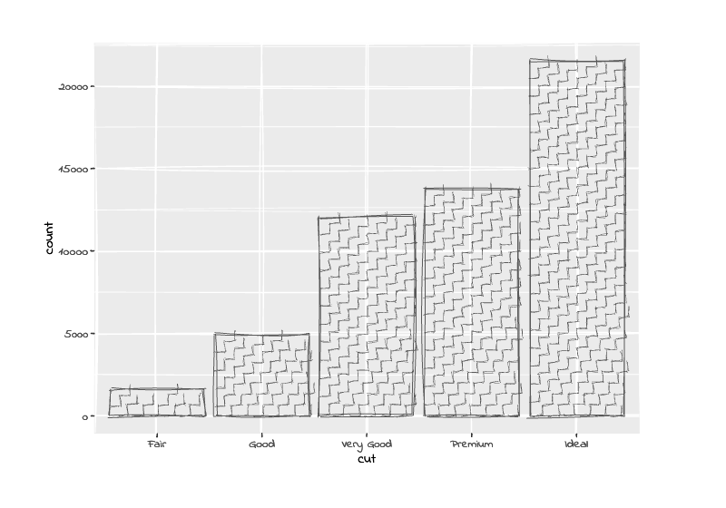

<!-- README.md is generated from README.Rmd. Please edit that file -->

# ggrough2

**ggrough2** converts ggplot2 visualizations into hand-drawn,
sketch-style graphics. It works by rendering your plot to SVG and then
re-drawing every element using [Rough.js](https://roughjs.com/).

This package is a rework of the dormant
[ggrough](https://github.com/xvrdm/ggrough) package.

## Installation

``` r
pak::pak("schochastics/ggrough2")
```

## Basic usage

Pass any ggplot object to `rough_plot()`.

``` r
library(ggplot2)
library(ggrough2)

p <- ggplot(mpg, aes(displ, hwy)) +
  geom_point()

rough_plot(p, width = 7, height = 5)
```



## Fill styles

The `fill_style` argument controls how filled shapes (bars, areas,
boxes) are drawn. Available options are `"hachure"` (default),
`"cross-hatch"`, `"dots"`, `"zigzag"`, `"dashed"`, `"zigzag-line"`, and
`"solid"`.

``` r

p <- ggplot(diamonds, aes(cut)) +
  geom_bar()

rough_plot(p, fill_style = "cross-hatch")
```



``` r
rough_plot(p, fill_style = "dots")
```


## Background fill style

Use `bg_fill_style` to control the fill style of panel and plot
backgrounds independently from data elements. By default backgrounds are
`"solid"` while geoms use `"hachure"`.

``` r

p <- ggplot(mpg, aes(displ, hwy)) +
  geom_point(size = 3) +
  theme(
    panel.background = element_rect(fill = "grey66"),
    plot.background  = element_rect(fill = "grey66")
  )

# solid panel background, hachure geoms (default)
rough_plot(p)
```



``` r

# hachure panel background, cross-hatch geoms
rough_plot(p, fill_style = "cross-hatch", bg_fill_style = "hachure")
```



## Roughness and bowing

`roughness` controls how jagged the lines are (0 = perfectly smooth, up
to 10). `bowing` controls how much straight lines bow outwards. Higher
values create a more exaggerated hand-drawn effect.

``` r
p <- ggplot(mpg, aes(class)) +
  geom_bar()

rough_plot(p, roughness = 3, bowing = 2)
```



## Reproducible output

Rough.js uses randomness to vary each stroke. Pass `seed` to get a
stable result.

``` r
rough_plot(p, seed = 42)
```



``` r
rough_plot(p, seed = 42)
```


## Custom fonts

Text labels default to the bundled [Indie
Flower](https://fonts.google.com/specimen/Indie+Flower) handwritten
font. Supply any `.ttf`, `.otf`, `.woff`, or `.woff2` file to use a
different one, or set `font = NULL` to keep the original plot fonts.

``` r
# custom font
rough_plot(p, font = "path/to/myfont.ttf")

# keep the plot's original fonts
rough_plot(p, font = NULL)
```

## Fine-tuning with `rough_options()`

For finer control over fill appearance, pass a `rough_options()` list to
the `options` argument. All parameters default to `NULL` (library
defaults apply).

**Hachure spacing and line weight** — `hachure_gap` sets the pixel
distance between fill lines; `fill_weight` sets their thickness.

``` r
p <- ggplot(diamonds, aes(cut)) +
  geom_bar()

# wider gap between hachure lines, thicker lines
rough_plot(p, fill_style = "hachure",
           options = rough_options(hachure_gap = 6, fill_weight = 1.5))
```



**Hachure angle** — rotate the fill lines with `hachure_angle`
(degrees).

``` r
# nearly horizontal lines
rough_plot(p, fill_style = "hachure",
           options = rough_options(hachure_angle = -10))
```


**Zigzag fill** — `zigzag_offset` controls the width of the zigzag
triangles when using `"zigzag-line"` fill style.

``` r
rough_plot(p, fill_style = "zigzag-line",
           options = rough_options(hachure_gap = 5, zigzag_offset = 8))
```



## Saving output

Export to a standalone HTML file (no external dependencies):

``` r
save_rough_html(p, "my_plot.html")
```

Export to PNG or SVG (requires the
[webshot2](https://rstudio.github.io/webshot2/) package and a
Chrome/Chromium installation):

``` r
save_rough_image(p, "my_plot.png")
save_rough_image(p, "my_plot.svg")
```
